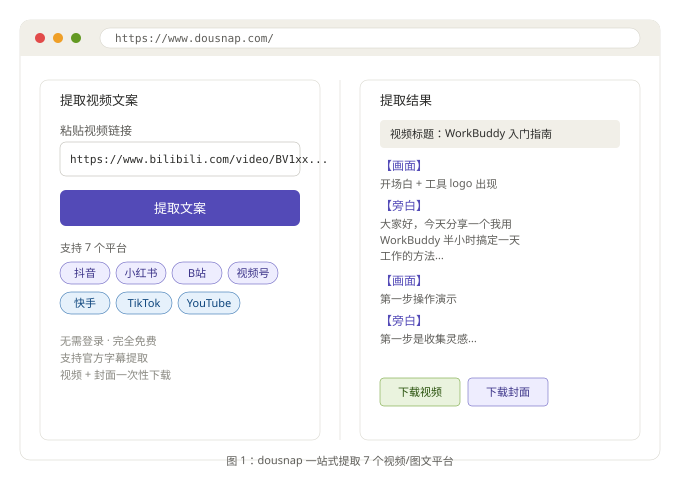

# link-to-inbox：跨平台链接自动归档 Skill（v1.7.0）

> **一句话**：把公众号、小红书、抖音、快手、B站、视频号、TikTok、YouTube、知识星球 9 个平台的链接，统一归档到 Obsidian 02.素材收件箱。
>
> **仓库**：https://github.com/Sheldon460/link-to-inbox
>
> **License**：MIT
>
> **最新版本**：v1.7.0（2026-08-24，新增知识星球）

---

## 一、核心能力

| 平台 | URL 识别 | 抓取入口 | 耗时参考 | 视频 | 字幕 |
|------|---------|---------|---------|------|------|
| 公众号 | `mp.weixin.qq.com` | WebFetch + curl | < 10 秒 | ❌ | ❌ |
| 小红书 | `xhslink.com` / `xiaohongshu.com` | dousnap / chrome-direct | 30-60 秒 | ❌ | ❌ |
| 抖音 | `douyin.com` / `v.douyin.com` | dousnap / convry | 30 秒 | ✅ | ASR |
| 快手 | `v.kuaishou.com` / `kuaishou.com` | dousnap | 30 秒 | ✅ | ASR |
| B站 | `bilibili.com` / `b23.tv` | dousnap / yt-dlp | 1-2 分钟 | ✅ | 官方 |
| 视频号 | `channels.weixin.qq.com` | dousnap / convry | 30-90 秒 | ✅ | ASR |
| TikTok | `tiktok.com` | dousnap | 30-60 秒 | ✅ | ASR |
| YouTube | `youtube.com` / `youtu.be` | dousnap | 30-60 秒 | ✅ | ASR |
| 知识星球 | `zsxq.com` / `wx.zsxq.com` | `zsxq-cli topic +detail` | < 5 秒 | ❌ | ❌ |
| 通用网页 | 其他 | WebFetch | 10-30 秒 | ❌ | ❌ |

---

## 二、抓取流程（以 B 站为例）

### 1. 触发

在 WorkBuddy 对话里发：

```
帮我归档 https://www.bilibili.com/video/BV1xxxxxxxxxx
```

### 2. URL 识别

```
bilibili.com → B站 → 归档目录 13.B站/YYYY-MM-DD-作者-标题/
```

### 3. dousnap 抓取

```
1. browser-act 打开 https://www.dousnap.com/
2. setNativeValue 触发 React 同步 + 模拟点击「提取文案」
3. 等待 30-60 秒，拿到结构化输出：
   - 视频标题
   - UP主 / 作者
   - 【画面】【旁白】分段文案
   - 封面图
   - 视频下载链接
4. 下载视频到 13.B站/YYYY-MM-DD-作者-标题/
```

### 4. 转写（视频）

```
ffmpeg -i 视频.mp4 -vn -ac 1 -ar 16000 audio.wav
whisper-cli -m ~/Models/whisper/ggml-large-v3-turbo.bin \
  -f audio.wav -l zh -otxt -of 转录文本
```

B 站用官方字幕（dousnap 自带），准确度比 ASR 高 20-30%。

### 5. 生成 Markdown

```yaml
---
title: "WorkBuddy 入门指南"
created: 2026-08-24
source: "B站 - 老番茄"
source_url: "https://www.bilibili.com/video/BV1xxx"
date: 2026-08-20
imported_at: 2026-08-24T18:00:00+08:00
tags:
  - 素材收件箱
  - B站
  - AI工具
type: inbox-raw
extraction_status: "dousnap; 视频 + 字幕; 8.2k 赞"
author: "老番茄"
images_path: "[[视频.mp4]]"
---
```

---

## 三、目录结构

```
02.素材收件箱/
├── 02.微信文章/         # images/ 子目录
├── 03.小红书素材/       # <分类>/子目录
├── 05.网页文字/         # 通用网页
├── 07.抖音视频/         # 视频 + 转录
├── 11.视频号/           # 视频 + 转录
├── 12.快手/             # 视频 + 转录
├── 13.B站/              # 视频 + 转录
├── 14.海外/             # TikTok/YouTube
└── 15.知识星球/         # v1.7.0 新增
```



---

## 四、工具清单

### 4.1 系统要求

- macOS 12+ / Ubuntu 22.04+
- Python 3.10+
- Node.js 18+
- Obsidian（iCloud 或本地 vault）
- 磁盘 ≥ 10 GB

### 4.2 必备 CLI

```bash
# macOS
brew install python ffmpeg node
pip3 install -U yt-dlp
npm install -g browser-act zsxq-cli

# Whisper（视频转写）
brew install whisper-cpp
bash <(whisper-cpp 路径)/models/download-ggml-model.sh large-v3-turbo
```

### 4.3 各 CLI 职责

| CLI | 用途 | 必需平台 |
|-----|------|---------|
| `browser-act` | 浏览器自动化（驱动 dousnap + 本机 Chrome） | 全平台 |
| `yt-dlp` | B站视频下载（合并音视频流） | B站 |
| `ffmpeg` | 视频抽音频 | 视频平台 |
| `whisper-cli` | 本地 ASR 转写 | 视频平台（非 B站） |
| `zsxq-cli` | 知识星球 JSON API | 知识星球 |

---

## 五、安装步骤

```bash
# 1. 克隆仓库
git clone https://github.com/Sheldon460/link-to-inbox.git
cd link-to-inbox

# 2. 装 CLI（macOS 一行）
brew install python ffmpeg node && \
pip3 install -U yt-dlp && \
npm install -g browser-act zsxq-cli

# 3. 装 whisper 模型
mkdir -p ~/Models/whisper
# 从 https://huggingface.co/ggerganov/whisper.cpp 拉 ggml-large-v3-turbo.bin

# 4. 知识星球 OAuth 登录
zsxq-cli auth login

# 5. 安装 skill
mkdir -p ~/.workbuddy/skills/link-to-inbox
cp skill/SKILL.md ~/.workbuddy/skills/link-to-inbox/

# 6. 重启 WorkBuddy
```

---

## 六、关键设计决策

### 6.1 为什么优先 dousnap？

- **覆盖 7 个平台**（抖音/小红书/快手/B站/视频号/TikTok/YouTube）
- **免费、无登录、无验证码**
- **自带【画面】【旁白】结构化输出**（脚本可直接复用）
- **解决视频号痛点**：绕开 macOS 保存面板，远程无人值守可行

### 6.2 为什么知识星球走 zsxq-cli 而非 dousnap？

- 知识星球是登录态封闭生态，dousnap 无访问能力
- `zsxq-cli` 是官方 CLI，OAuth 登录后直连 API
- 返回 JSON 结构化数据，无需 HTML 解析
- 比网页抓取稳定 10 倍以上

### 6.3 为什么公众号不走 dousnap？

- 公众号文章是图文，无视频
- WebFetch + curl 直接抓 HTML 更快
- mmbiz.qpic.cn 图片用 curl + Referer 防盗链绕过

### 6.4 frontmatter 标准化

- 所有平台统一字段：`title / source / date / tags / type / extraction_status`
- 平台专属字段：
  - 知识星球：`topic_id / group_id / type`（talk/qa/task/solution）
  - 视频平台：`duration`（时长）
- 配合 Obsidian Dataview 可做任意维度检索

---

## 七、性能数据（实测）

| 场景 | 耗时 | 输出大小 |
|------|------|---------|
| 公众号文章（含 5 图） | 8 秒 | ~2 MB |
| 小红书（含 9 图 webp） | 45 秒 | ~3 MB |
| 抖音 2 分钟视频 | 30 秒 + 90 秒转写 | ~15 MB |
| B站 10 分钟视频 | 60 秒 + 0 秒（官方） | ~50 MB |
| 视频号 1 分钟视频 | 60 秒 + 45 秒转写 | ~8 MB |
| 知识星球主题（含 3 图） | 5 秒 | ~1 MB |

---

## 八、错误处理速查

| 错误 | 处理 |
|------|------|
| 小红书 300031（token 过期） | 站内搜索方案拿新 token |
| 视频号 macOS 保存面板 | 已通过 dousnap 绕过 |
| B站 1080P 60 帧 missing | 降级到 1080P 普通 |
| 知识星球 401 | `zsxq-cli auth login` 重新 OAuth |
| 知识星球 403 | 切换账户或加入对应星球 |

---

## 九、扩展开发

新增平台步骤（以微博为例）：

1. 在 dousnap 验证是否支持
2. 编辑 `skill/SKILL.md`：
   - frontmatter description 加入平台
   - 工作流图加入分支
   - 归档目录映射表 + URL 识别表 + Python 判断逻辑
   - 新增 `### 2.X` 章节
3. 加 frontmatter 适配（如有专属字段）
4. 更新 README 平台覆盖表
5. 加示例到 `examples/`
6. 更新 `docs/changelog.md` 版本号
7. PR 到 https://github.com/Sheldon460/link-to-inbox

---

## 十、引用

- **仓库**：https://github.com/Sheldon460/link-to-inbox
- **README**：装一遍流程、平台覆盖、错误处理
- **docs/platform-matrix.md**：平台能力对照矩阵
- **docs/error-codes.md**：全平台错误码处理表
- **docs/changelog.md**：版本历史

---

**讨论**：你在用哪款抓取工具？踩过什么坑？欢迎评论区聊聊，互相取经。